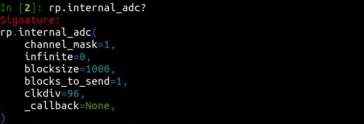

# RP2DAQ - Raspberry Pi Pico for Data Acquisition (and much more)

Raspberry Pi Pico is a small, but quite powerful microcontroller board. When connected to a computer over USB, it can serve as an interface to hardware - which may be as simple as a digital thermometer, or as complicated as scientific experiments tend to be. 

This project presents both precompiled firmware and a user-friendly Python module to control it. The firmware takes care of all technicalities at the microcontroller side including parallel task handling and reliable communication, and is optimized to harness Raspberry Pi's maximum performance. All actions of RP2DAQ are triggered by the Python script in the computer, . This saves the user from programming in C and from error-prone hardware debugging. Even without any programming, one can try out few supplied *Example programs*. 

If needed, entirely new capabilities can be added into the [open source](LICENSE) firmware. More is covered in the [developer documentation for the C firmware](docs/DEVELOPERS.md). Contributing new code back is welcome. 

***Project status: basic work done, real-world testing underway***

 * Features implemented and planned: 
    * [x] built-in ADC (continuous 12-bit measurement, at 500k samples per second)
    * [x] stepper motors (pulse control for up to 12 "stepstick" drivers simultaneously)
	* [x] digital pin output
	* [x] digital pin input (direct, or report on rising/falling edge)
	* [x] pulse-width modulation (up to 16 PWM channels)
	* [ ] pulse frequency and timing measurement
	* [ ] digital messaging (USART/I2C/I2S/SPI) for sensors 
	* [ ] high-speed digital acquisition (e.g. 100 MSPS logic analyzer, or oscilloscope using AD9288)
 * Documentation:
    * [x] [No programming: setting up hardware and first tests](#no-programming-setting-up-hardware-and-first-tests)
    * [ ] Python programming: basic concepts and examples
    * [ ] [C programming: extending rp2daq's capabilities](docs/DEVELOPERS.md)
    * [x] [PAQ - Presumably asked questions](#paq-presumably-asked-questions)

# No programming: setting up hardware and first tests

### Get material

 * Raspberry Pi Pico ($5),
 * USB micro cable ($3),
 * a computer with [Python (3.8+)](https://realpython.com/installing-python/) and ```python-pyserial``` package installed.
	* On Windows, [get anaconda](https://docs.anaconda.com/anaconda/install/windows/) if unsure.
	* On Linux, Python3 should already be there
    * On Mac, it should be there though [version update](https://code2care.org/pages/set-python-as-default-version-macos) may be needed

### Upload the firmware (only once)

1. [Download](https://github.com/FilipDominec/rp2daq/archive/refs/heads/main.zip) and unzip this project. 
    * (If preferred, you can also use ```git clone https://github.com/FilipDominec/rp2daq.git```)
1. Holding the white "BOOTSEL" button on Raspberry Pi Pico, connect it to your computer with the USB cable. Release the ```BOOTSEL``` switch.
    * In few seconds it should register as a new flash drive, containing INDEX.HTM and INFO_UF2.TXT. 
1. Copy the ```build/rp2daq.uf2``` file to RP2. 
    * *The flashdrive should disconnect in a second.* 
    * *The green diode on RP2 then blinks twice, indicating the firmware is running and awaiting commands.*

### Run hello_world.py

Launch the ```hello_world.py``` script in the main project folder. 


* If an rp2daq device is available, a window like the one depicted on left should appear; you can interactively control the onboard LED with the buttons.  
* If an error message appears (like depicted right), the device does not respond correctly. Check it blinks twice when USB is re-connected, or make sure you uploaded fresh firmware. 
* If no window appears, there is some trouble with your Python installation.


# Python programming: basic concepts

### Let's start with an example

To check everything is ready,  launch your python3 interpreter (i.e. ```python3```, or better ```ipython3```) and paste following three lines:

```Python
import rp2daq          # import the module (must be available in your PYTHONPATH)
rp = rp2daq.Rp2daq()   # connect to first Pi Pico where RP2DAQ is uploaded
rp.pin_out(25, 1)      # sets pin no. 25 to logical 1
```

The pin number 25 is connected to the green onboard LED - it should turn on.

### Receiving data

Similarly, you can get ADC readout. With default configuration, it will measure 1000 voltage values on the pin 26:

```Python
import rp2daq
rp = rp2daq.Rp2daq()

result = rp.internal_adc()
print(result)
```

The last line prints a standard pythonic dictionary, with several (more or less useful) key:value pairs. Among these, the ADC readouts are simply named ```data```.

### Finding out optional parameters

Most RP2DAQ's commands accept optional, so called *named* parameters. If they are omitted, some reasonable default values are used.

A complete list of parameters for a command can be obtained e.g. in ipython environment by replacing ```()``` with a ```?``` and hitting enter:



Note that list of commands is suggested by ipython when one hits tab after writing ```rp.```


### Asynchronous commands

Consider the following example, which does almost the same as the previous one:

```Python
import rp2daq
rp = rp2daq.Rp2daq()

def my_callback(**result):
	print(result)

rp.internal_adc(_callback=my_callback)

print("code does not wait for ADC data here")
import time
time.sleep(.5) # required for noninteractive script, to not terminate before data arrive
```

One difference is that it looks a bit more complicated. But more important is that here the ```rp.internal_adc``` command does not block your program, no matter how long it takes to sample 1000 points. Only after the device responds data packet arrives back, the ```_callback``` function is called (in a separate thread) to process it. 

Calling commands asynchronously allows one to simultaneously orchestrate multiple functions like long ADC acquisition and stepping motor movement. Raspberry Pi may be busy for a while, but your program remains responsive all the time.

### Receiving a lot of data

Another useful application of the asynchronous command allows one to acquire exactly one million ADC samples. Such a large array could not fit into Pico's RAM, let alone into single report message (there is 8 kB limit for it). Following code thus can monitor slow processes, like temperature changes or battery discharge.

```Python
import rp2daq
rp = rp2daq.Rp2daq()

all_data = []

def my_callback(**kwargs):
    all_data.extend([sum(kwargs["data"])/1000])
    print(f"{len(all_data)} ADC samples received so far")
print(all_data)

rp.internal_adc(_callback=my_callback, blocks_to_send=1000)

print("code does not wait for ADC data here")
import time
time.sleep(.5)
rp.internal_adc(blocks_to_send=0)
```

Few practical notes:
   * If high temporal resolution is not necessary, each data packet can be averaged into a single number by not storing ```kwargs['data']```, but ```[sum(kwargs["data"])/1000]```. Note that averaging 1000 numbers improves signal to noise ratio sqrt(1000) ~ 31 times.
   * With option ```infinite=1```, the ADC reports will keep coming forever. Or until they are stopped by ```rp.internal_adc(blocks_to_send=0)```.
   * The built-in ADC is somewhat nonlinear.

More elaborate uses of ADC, as well as other features, can be found in the [example_ADC_async.py](example_ADC_async.py) and other example scripts.


# PAQ: Presumably Asked Questions

**Q: How does RP2DAQ differ from writing MicroPython scripts directly on RP2?**

A: They are two fundamentally different paths that may lead to similar results. [MicroPython](https://github.com/micropython/micropython) (and [CircuitPython](https://circuitpython.org/)) interpret Python code directly on a microcontroller (including RP2), so they are are good choice for a stand-alone device (if speed of code execution is not critical, which may be better addressed by custom C firmware). There are many libraries that facilitate development in MicroPython. 

In contrast, RP2DAQ assumes the microcontroller is constantly connected to computer via USB; then the precompiled firmware efficiently handles all actions and communication, so that you only need to write one Python script for your computer. 


**Q: Is the use of RP2DAQ limited to Raspberry Pi Pico board?**

A: Very likely it can be directly uploaded on other boards featuring the RP2040 microcontroller, e.g. RP2040-zero, but this has not been tested yet. 

Development of this project was started on the ESP32-WROOM module, but it suffered from its randomly failing (and consistently slow) USB communication, as well as somewhat lacking documentation.


**Q: Can RP2DAQ be controlled from other language than Python 3.8+?**

A: Perhaps, but - the firmware and computer communicate over a binary interface that would have to be ported to this language. One of the advantages of RP2DAQ is that the interface on the computer side is autogenerated; the corresponding C-code parser would have to be rewritten. Hard-coding the messages in another language would be a quicker option, but it would be bound to a single firmware version. Python is fine.


**Q: Are there projects with similar scope?**

A: [Telemetrix](https://github.com/MrYsLab/Telemetrix4RpiPico) also uses RP2 as a device controlled from Python script in computer. RP2DAQ aims for higher performance and broader range of capabilities. However, parts of RP2DAQ code and concepts were inspired by Telemetrix.


**Q: Does RP2DAQ implement all functions available by the Raspberry Pico SDK?**

A: By far not - and it is not even its scope. RP2DAQ's features make a higher layer above (a subset) of the SDK functions. But it is intended to cover most RP2040's features in the future.


**Q: Does RP2DAQ help communicating with scientific instruments, e.g. connected over GPIB/VISA?**

A: Interfacing to instruments is outside of RP2DAQ's scope, but [over 40 other projects](https://github.com/python-data-acquisition/meta/issues/14) provide Python interfaces for instrumentation and they can be imported into your scripts independently. While RP2DAQ does not aim to provide such interfaces, capabilities of RP2 could substitute some commercial instruments in less demanding use cases. 


**Q: Why are no displays or user interaction devices supported?**

A: The Python script has a much better display and user interaction interface - that is, your computer. RP2DAQ only takes care for the hardware interaction that computer cannot do. 


**Q: Can RP2DAQ control unipolar stepper motors using ULN2003?**

A: No. Both bipolar and unipolar steppers seem to be supported by stepstick/A4988 modules, with better accuracy and efficiency than provided by ULN2003. 


# Legal

The firmware and software are released under the [MIT license](LICENSE). 

They are free as speech after drinking five beers, that is, with no warranty of usefulness or reliability. RP2DAQ cannot be recommended for industrial process control.


