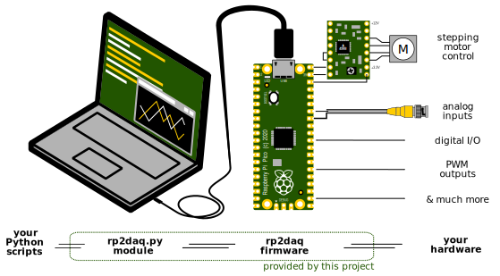

# RP2DAQ - Raspberry Pi Pico for Data Acquisition (and much more)

[Raspberry Pi Pico](https://www.raspberrypi.com/documentation/microcontrollers/raspberry-pi-pico.html) is a small, but quite powerful microcontroller board. When connected to a computer over USB, it can serve as an interface to hardware - which may be as simple as a digital thermometer, or as complicated as scientific experiments tend to be. 



This project presents both precompiled firmware and a user-friendly Python module to control it. The firmware takes care of all technicalities at the microcontroller side including parallel task handling and reliable communication, and is optimized to harness Raspberry Pi's maximum performance. All actions of RP2DAQ are triggered by the Python script in the computer. This saves the user from programming in C and from error-prone hardware debugging. Even without any programming, one can try out few supplied *Example programs*. 

If needed, entirely new capabilities can be added into the [open source](LICENSE) firmware. More is covered in the [developer documentation for the C firmware](docs/DEVELOPERS.md). Contributing new code back is welcome. 

*Development status: basic features implemented, successfully employed in several projects in the lab.*

 * Features implemented and planned: 
    * [x] analog input (continuous 12-bit measurement with built-in ADC, at 500k samples per second)
    * [x] stepper motors (pulse control for up to 12 "stepstick" drivers simultaneously)
	* [x] direct digital input/output (also high-Z and pull-up)
	* [x] pulse-width modulation output (up to 16 PWM channels)
	* [ ] pulse frequency and timing measurement
	* [ ] digital messaging (USART/I2C/I2S/SPI) for sensors 
	* [ ] high-speed digital acquisition (e.g. 100 MSPS logic analyzer, or oscilloscope using AD9288)
 * Documentation:
    * [x] [No programming: setting up hardware and first tests](#no-programming-first-steps)
    * [x] [Python programming: basic concepts and examples](#python-programming-basic-concepts)
    * [x] [Python command reference](docs/PYTHON_REFERENCE.md)
    * [ ] [C programming: adding new commands to rp2daq's firmware](docs/DEVELOPERS.md)
    * [x] [PAQ - Presumably asked questions](#paq-presumably-asked-questions)

# First steps with no programming

### Getting things ready

1. You will need a Raspberry Pi Pico (RP2) board with a USB cable.
1. You will also need a computer with [Python (3.6+)](https://realpython.com/installing-python/) interpreter and the ```serial``` and optionally ```tkinter``` modules.
	* On Windows, there are many options to get Python. If unsure, we suggest you download and simply unpack [Python Portable](https://sourceforge.net/projects/portable-python/). To get necessary modules enter run ```Console-Launcher.exe``` in unpacked folder and enter the command  ```pip install pyserial tk```. Then you can open any .py script with the App/python.exe.
	* On Linux, Python3 should already be there. Run either ```pip install pyserial tk```,  ```apt install python3-serial python3-tk``` or similar command according to your preferred installation approach.
    * On Mac, follow a similar approach; [version update](https://code2care.org/pages/set-python-as-default-version-macos) may be needed
1. Next we have to flash the device, this step is platform independent. Download the stable [binary firmware](https://github.com/FilipDominec/rp2daq/releases/latest/) for your version of the board. No compilation is necessary.
	* Holding the white "BOOTSEL" button on your RP2, connect it to your computer with the USB cable. Release the "BOOTSEL" button.  In few seconds the RP2 should appear as a fake flash drive, containing INDEX.HTM and INFO_UF2.TXT.
	* Copy the ```rp2daq.uf2``` firmware file directly to RP2 along these two files. The flashdrive should disconnect in a second. The green diode on RP2 then flashes twice, indicating the firmware is running and awaiting commands.
1. Download [the stable Python+C source](https://github.com/FilipDominec/rp2daq/releases/latest/) from the latest release. Unpack it in a working directory of your choice.

If you have problems, please [describe them in a new issue](https://github.com/FilipDominec/rp2daq/issues).

If you don't fear having problems, you can get fresh development code from this repository and compile the  firmware according to [Developer notes](docs/DEVELOPERS.md).

### Run hello_world.py

Launch the ```hello_world.py``` script in the main project folder. 


* If a window like the one depicted left appears, rp2daq is ready to be used! You can interactively control the onboard LED with the buttons.  
* If an error message appears (like depicted right) the device does not respond correctly. Check if your RP2 blinks twice when USB is re-connected, and make sure you uploaded fresh firmware. On Linux, Python may need [to adjust permissions](https://askubuntu.com/a/522776) to access the USB port.
* If no window appears, there is some deeper error with your Python installation. 


# Python programming: basic concepts

### Controlling the LED with 3 lines of Python code

To check everything is ready, navigate to the unpacked project directory and launch the Python command console.  [Ipython3](https://ipython.org/) is shown here, but [spyder](https://www.spyder-ide.org/), [idle](https://docs.python.org/3/library/idle.html) or bare ```python3``` console will work too.

```Python
import rp2daq          # import the module (must be available in your PYTHONPATH)
rp = rp2daq.Rp2daq()   # connect to the Pi Pico
rp.gpio_out(25, 1)     # sets GPIO no. 25 to logical 1
```

The GPIO (general-purpose input-output) 25 is connected to the green onboard LED on Raspberry Pi Pico - it should turn on when you paste these three lines. Turning the LED off is a trivial exercise for the reader.

### Receiving analog data

Similarly, you can get a readout from the built-in analog/digital converter (ADC). With default configuration, following command will measure 1000 voltage values on the GPIO 26:

```Python
import rp2daq
rp = rp2daq.Rp2daq()
return_values = rp.adc()
print(return_values)
```

Most commands take several named parameters which change their default behaviour; e.g. calling ```rp.adc(channel_mask=16)``` will connect the ADC to the built-in thermometer. If the parameters are omitted, some reasonable default values are always used. 

In few milliseconds, the above command returns a report as a namedtuple object, with several (more or less useful) attributes. For example, the adc command may return this: 

```
adc_report_values(report_code=6, 
		data_count=1000, 
		data_bitwidth=12, 
		start_time_us=2129748122, 
		end_time_us=2129750145, 
		start_sync_value=0, 
		end_sync_value=0, 
		channel_mask=1, 
		blocks_to_send=0, 
		block_delayed_by_usb=0, 
		data=[764, 783, 801, 816, 833, 857, 867, ... 931])
```

Among these attributes, the list of numbers measured by the ADC are simply accessible as ```return_values.data```. Number ```0``` corresponds to ca. 0 V, and ```4095``` to cca 3.2 V.

You can find more detailed information on the commands and reports in the (docs/PYTHON_REFERENCE.md) file. Note that none of these commands are explicitly listed in the python code, as they are generated dynamically by parsing the C code on startup. This eliminates redundancy between the C firmware and the Python module, and always guarantees their perfect binary compatibility.

### Tip: Use TAB completion

The ```ipython3``` interface has numerous user-friendly features. For instance, a list of commands is suggested by ipython when one hits TAB after writing ```rp.```:


The docstring for any command is printed out when one adds ```?``` and hits enter:


### Asynchronous commands

Consider the following ADC readout code, which looks different, but does *almost* the same as the previous example:

```Python
import rp2daq
rp = rp2daq.Rp2daq()

def my_callback(return_values):
	print(return_values)

rp.adc(_callback=my_callback)     # non-blocking!

print("code does not wait for ADC data here")
import time
time.sleep(.5) # required for noninteractive script, to not terminate before data arrive
```

The important difference is that here, the ```rp.adc``` is provided with a *callback* function. This makes it *asynchronous*: it does no more block further program flow, no matter how long it takes to sample 1000 points. Only after the report is received from the device, your function specified as the ```_callback``` is called (in a separate thread) to process it. 

Calling commands asynchronously allows one to simultaneously orchestrate multiple rp2daq commands. It is particularly useful for commands taking long time to finish, like extensive ADC acquisition or stepping motor movement. 

### Caveats of advanced asynchronous commands use
You can call synchronous rp2daq commands of one type and asynchronous commands of another type without problems.

It is not advisable, however, to issue two asynchronous commands of the same type with two different callback functions, if there is a possibility of the first command finishing after the second was called: 

This comes from that your callback function is assigned to one *command type*, not to *each unique command* you issued. 

As a result, if you launch two long-duration commands of the same type in close succession (e.g. stepping motor movements), first one with ```_callback=A```, second one with ```_callback=B```, each motor reporting its move being finished will eventually result in calling the ```B``` function as their callback. 

The clean and recommended approach is therefore to define one callback function for a given command type. It can easily tell apart the reports from multiple stepper motors, using information it receives as keyword arguments.

Likewise, an asynchronous command should never be followed by a synchronous one of the same type, as the latter erases the callback. In such a case, the first command would erroneously interrupt waiting for the second one.

Both synchronous and asynchronous commands can be issued even from within some command's callback. This allows for command chaining in an efficient event-driven loop.


### Asynchronous command with multiple reports

Maybe the greatest strength of the asynchronous commands lies in their ability to transmit unlimited amount of data through subsequent reports. 

The following example measures one million ADC samples; these would not fit into Pico's 264kB RAM, let alone into single report message (limited by 8k buffer). This is necessary to monitor slow processes, e.g., temperature changes or battery discharge.

If high temporal resolution is not necessary, each data packet can be averaged into a single number by not storing ```kwargs.data```, but ```[sum(kwargs.data)/1000]```. Note that averaging 1000 numbers improves signal to noise ratio sqrt(1000) ~ 31 times.

```Python
import rp2daq
rp = rp2daq.Rp2daq()

all_data = []

def my_callback(rv):
    all_data.extend([sum(rv.data])/1000])
    print(f"{len(all_data)} ADC samples received so far")
print(all_data)

rp.adc(
	blocks_to_send=1000, 
	_callback=my_callback)

print("code does not wait for ADC data here")
import time
time.sleep(.5)
rp.adc(blocks_to_send=0)
```

An alternative to ```blocks_to_send=1000``` is setting ```infinite=1```. The the ADC reports will keep coming, until they are stopped by another command ```rp.adc(blocks_to_send=0)```.

More elaborate uses of ADC, as well as other features, can be found in the [example_ADC_async.py](example_ADC_async.py) and other example scripts.


# PAQ: Presumably Asked Questions

<details>
  <summary><ins>Q: How does Rp2daq differ from writing MicroPython scripts directly on RP2?</ins></summary>
  
  A: They are two fundamentally different paths that may lead to similar results. [MicroPython](https://github.com/micropython/micropython)[](https://github.com/exoclime/helios/stargazers/) (and [CircuitPython](https://circuitpython.org/)) interpret Python code directly on a microcontroller (including RP2), so they are are good choice for a stand-alone device (if speed of code execution is not critical, which may be better addressed by custom C firmware). There are many libraries that facilitate development in MicroPython. 

  In contrast, rp2daq assumes the microcontroller is constantly connected to computer via USB; then the precompiled firmware efficiently handles all actions and communication, so that you only need to write one Python script for your computer. 
</details>


<details>
  <summary><ins>Q: Can I use Rp2daq with other boards than Raspberry Pi Pico?</ins></summary>

A: Very likely it can be directly uploaded to all boards featuring the RP2040 microcontroller. 
Obviously the available GPIO number, as well as their assignment, may differ. For instance the colourful LED on the *RP2040-zero* is in fact a WS2812B chip, and its data bus is connected to GPIO 16.

However, the *RP2040-zero* randomly failed to connect over USB, as reported elsewhere


; we cannot consider it fully supported.

Boards featuring the newer RP2350 microcontroller are not currently supported, but we plan porting rp2daq firmware to these, too.

The Arduino family of boards is not supported. Neither the ESP/Espressif boards are. (Development of this project was started on the ESP32-WROOM module, but it suffered from its randomly failing (and consistently slow) USB communication, as well as somewhat lacking documentation.)
</details>


<details>
  <summary><ins>Q: Can a Rp2daq device be controlled from other language than Python 3.6+?</ins></summary>

A: Perhaps, but it would be rather hard. The firmware and computer communicate over a binary interface that would have to be ported to this language. One of the advantages of RP2DAQ is that the interface on the computer side is autogenerated; the corresponding C-code parser would have to be rewritten. Hard-coding the messages in another language would be a quicker option, but it would be bound to a single firmware version. 

Python is fine.
</details>


<details>
  <summary><ins>Q: Are there projects with similar scope?</ins></summary>

A: [Telemetrix](https://github.com/MrYsLab/Telemetrix4RpiPico) also uses Raspberry Pi Pico as a device controlled from Python script in computer. Rp2daq started independently, with focus on higher performance and broader range of capabilities. However, the report handling subsystem in Rp2daq was inspired by Telemetrix.

[PyFirmata](https://pypi.org/project/pyFirmata/) does a similar job, but has not received an update for a while. 

[Belay](https://github.com/BrianPugh/belay)

Digital I/O can similarly be performed with [PyFtdi](https://github.com/eblot/pyftdi). 

We believe the set of features in rp2daq is unique. 
</details>


<details>
  <summary><ins>Q: Can Rp2daq communicate with scientific instruments, e.g. connected over GPIB/VISA?</ins></summary>

A: No, although basic support e.g. for less common interfaces GPIB could be added in the future. 

Digital interfacing with lab instrumentation is outside of Rp2daq's scope, but [over 40 other projects](https://github.com/python-data-acquisition/meta/issues/14) provide Python interfaces for instrumentation and they can be imported into your scripts independently. While Rp2daq does not aim to provide such interfaces, capabilities of RP2 could substitute some commercial instruments in less demanding use cases. 
</details>


<details>
  <summary><ins>Q: Why are no displays or user interaction devices supported?</ins></summary>

A: The Python script has a much better display and user interaction interface - that is, your computer. Rp2daq only takes care for the hardware interaction that computer cannot do. 
</details>


<details>
  <summary><ins>Q: Can Rp2daq control unipolar stepper motors using ULN2003?</ins></summary>

A: No. Both bipolar and unipolar steppers seem to be supported by stepstick/A4988 modules, with better accuracy and efficiency than provided by ULN2003. 
</details>

<details>
  <summary><ins>Q: Running my script in Spyder IDE results in device not reporting </ins></summary>

A: Spyder and probably some other IDEs run a persistent process which blocks the USB port even after your script apparently finishes. Your script has to explicitly release the port using ```rp.quit()``` at the end. Or you can manually reset the kernel in the Spyder's Python console, for which there is also an option in the Spyder's Preferences: see tab "Python configuration", uncheck the option "User Modules Reloader".
</details>

<details>
  <summary><ins>Q: Will rp2daq run on legacy Windows 7/8/XP? </ins></summary>

A: Python 3.8 is the latest supported version on *Windows 7 Service Pack 2*. (The W7 SP1 has to be updated to SP2, Python fails "parameter is incorrect" error otherwise.)

On Windows 7/8 by default there is no driver for Pico to list as an accessible serial port, it appears as "Board CDC" in hardware manager instead. 
A driver to fix this can be downloaded from https://github.com/Melvinsajith/raspberrry_Pi_Pico_windows_7_8_xp.
Before pointing Windows to the ```pico-serial.inf``` file as a driver for your Pico, one has to replace all four ```PID_0005``` strings to ```PID_000A``` according to the fact we the device is not running Micropython, but custom firmware. 

We tested rp2daq to work fine on such a W7+SP2 system; Windows 8 should work too. Windows XP were not tested and are not sure to work, but they are mentioned in the above link.

</details>

<details>
  <summary><ins>Q: On Linux, the device is not detected by rp2daq </ins></summary>

A: Typically, a rp2daq device connected to Linux over USB is represented by one of /dev/ttyACM* character devices. If there is no hardware failure, the user permissions to access these character devices may be missing. Make sure you are in the ```dialout``` user group; in command line this is simply done by ```sudo usermod -aG dialout ${USER}```.

</details>

<details>
  <summary><ins>Q: My editor/IDE provides no hints for the methods of the rp2daq objects </ins></summary>

A: This results from that they are not present in Python; they are always dynamically generated by parsing C-code. This prevents repeating code between C/Python interfaces and possible errors coming from mismatch. Please look at docs/PYTHON_REFERENCE.md, which is also auto-generated. 

</details>


# Legal

The firmware and software are released under the [MIT license](LICENSE). 

They are free as speech after drinking five beers, that is, with no warranty of usefulness or reliability. Rp2daq cannot be recommended for industrial process control.


