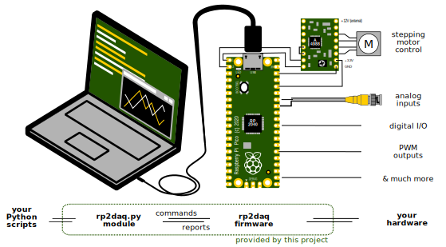

# RP2DAQ - Raspberry Pi Pico for Data Acquisition (and much more)

Raspberry Pi Pico is a small, but quite powerful microcontroller board. When connected to a computer over USB, it can serve as an interface to hardware - which may be as simple as a digital thermometer, or as complicated as scientific experiments tend to be. 



This project presents both precompiled firmware and a user-friendly Python module to control it. The firmware takes care of all technicalities at the microcontroller side including parallel task handling and reliable communication, and is optimized to harness Raspberry Pi's maximum performance. All actions of RP2DAQ are triggered by the Python script in the computer. This saves the user from programming in C and from error-prone hardware debugging. Even without any programming, one can try out few supplied *Example programs*. 

If needed, entirely new capabilities can be added into the [open source](LICENSE) firmware. More is covered in the [developer documentation for the C firmware](docs/DEVELOPERS.md). Contributing new code back is welcome. 

*Development status: basic features implemented, real-world testing underway*

 * Features implemented and planned: 
    * [x] analog input (continuous 12-bit measurement with built-in ADC, at 500k samples per second)
    * [x] stepper motors (pulse control for up to 12 "stepstick" drivers simultaneously)
	* [x] digital pin output (direct pin write, also high-Z and pull-up can be controlled)
	* [x] digital pin input (on-demand read, or report on rising/falling edge)
	* [x] pulse-width modulation output (up to 16 PWM channels)
	* [ ] pulse frequency and timing measurement
	* [ ] digital messaging (USART/I2C/I2S/SPI) for sensors 
	* [ ] high-speed digital acquisition (e.g. 100 MSPS logic analyzer, or oscilloscope using AD9288)
 * Documentation:
    * [x] [No programming: setting up hardware and first tests](#no-programming-first-steps)
    * [x] [Python programming: basic concepts and examples](#python-programming-basic-concepts)
    * [x] [Python command reference](docs/PYTHON_REFERENCE.md)
    * [ ] [C programming: adding new commands to rp2daq's firmware](docs/DEVELOPERS.md)
    * [x] [PAQ - Presumably asked questions](#paq-presumably-asked-questions)

# No programming: first steps

### Uploading rp2daq firmware

1. Get material: a Raspberry Pi Pico (RP2) with a USB cable, and a computer with [Python (3.6+)](https://realpython.com/installing-python/) and ```python-pyserial``` installed.
	* On Windows, [get anaconda](https://docs.anaconda.com/anaconda/install/windows/) if unsure.
	* On Linux, Python3 should already be there, and ```pyserial``` can be installed through your package manager or with [pip3](https://pypi.org/project/pyserial/)
    * On Mac, it should be there though [version update](https://code2care.org/pages/set-python-as-default-version-macos) may be needed
1. [Download](https://github.com/FilipDominec/rp2daq/archive/refs/heads/main.zip) and unzip this project. (Or you can also ```git clone``` this repo.)
1. Holding the white "BOOTSEL" button on your RP2, connect it to your computer with the USB cable. Release the "BOOTSEL" button.
    * *In few seconds the RP2 should appear as a fake flash drive, containing INDEX.HTM and INFO_UF2.TXT.*
1. Copy the ```build/rp2daq.uf2``` file directly to RP2. 
    * *The fake flashdrive should disconnect in a second.* 
    * *The green diode on RP2 then flashes twice, indicating the firmware is running and awaiting commands.*

### Run hello_world.py

Launch the ```hello_world.py``` script in the main project folder. 


* If a window like the one depicted left appears, rp2daq device is ready to be used! You can interactively control the onboard LED with the buttons.  
* If an error message appears (like depicted right) the device does not respond correctly. Check it your RP2 blinks twice when USB is re-connected, and make sure you uploaded fresh firmware. 
* If no window appears, there is some error with your Python3 or ```python-pyserial``` installation. 


# Python programming: basic concepts

### Controlling LED with 3 lines of Python code

To check everything is ready, navigate to the unpacked project directory and launch the Python command console.  [Ipython3](https://ipython.org/) is shown here, but [spyder](https://www.spyder-ide.org/), [idle](https://docs.python.org/3/library/idle.html) or bare ```python3``` console will work too.

```Python
import rp2daq          # import the module (must be available in your PYTHONPATH)
rp = rp2daq.Rp2daq()   # connect to the Pi Pico
rp.pin_set(25, 1)      # sets pin no. 25 to logical 1
```

The pin number 25 is connected to the green onboard LED on Raspberry Pi Pico - it should turn on when you paste these three lines. Turning the LED off is a trivial exercise for the reader.

### Receiving analog data

Similarly, you can get a readout from the built-in analog/digital converter (ADC). With default configuration, it will measure 1000 voltage values on the pin 26:

```Python
import rp2daq
rp = rp2daq.Rp2daq()
print( rp.internal_adc() )
```

The ```internal_adc()``` command returns a standard pythonic dictionary, with several (more or less useful) *key:value* pairs. Among these, the ADC readouts are simply named ```data```; value ```0``` corresponds to cca 0 V, and ```4095``` to cca 3.2 V.

Most commands take several named parameters which change their default behaviour; e.g. calling ```rp.internal_adc(channel_mask=16)``` will switch the ADC to get raw readouts from the built-in thermometer.


### Tip: Use TAB completion

The ```ipython3``` interface has numerous user-friendly features. For instance, a list of commands is suggested by ipython when one hits TAB after writing ```rp.```:


The docstring for any command is printed out when one adds ```?``` and hits enter:


Note that most RP2DAQ's commands accept optional, so called *named* parameters. If they are omitted, some reasonable default values are used.

Alternately, the same information is extracted in the [Python API reference](docs/PYTHON_REFERENCE.md).


### Asynchronous commands

Consider the following ADC readout code, which does almost the same as the previous example:

```Python
import rp2daq
rp = rp2daq.Rp2daq()

def my_callback(**kwargs):
	print(kwargs)

rp.internal_adc(_callback=my_callback)     # non-blocking!

print("code does not wait for ADC data here")
import time
time.sleep(.5) # required for noninteractive script, to not terminate before data arrive
```

Obviously, it is a bit more complicated. But more important is that here the ```rp.internal_adc``` command does not block your program, no matter how long it takes to sample 1000 points. Only after the report is received from the device, your ```_callback``` function is called (in a separate thread) to process it. 

Calling commands asynchronously allows one to simultaneously orchestrate multiple rp2daq commands. This is especially useful for long ADC acquisition and stepping motor movement: the device may take some seconds or even minutes to finish the command, but your program remains responsive. Meanwhile, it can also send other commands to the device.

### Caveats of advanced asynchronous commands use

Note that a callback is remembered in relation to a *command type*, not to *each unique command*. So if you launch two long-duration commands of the same type in close succession (e.g. stepping motor movements), first one with ```_callback=A```, second one with ```_callback=B```, each motor finishing its move will eventually result in calling the ```B``` function as their callback. This should not cause much trouble, as the callbacks still can tell the corresponding motor numbers apart, thanks to the information passed as keyword arguments to ```B```.

Both synchronous and asynchronous commands can be issued even from within a callback. 

It is not recommended to mix *asynchronous* and *synchronous* commands *of the same type* and in close succession: Before the first command finishes and corresponding callback is dispatched, the second command would erase the associated callback, and the return message from the first command would not be handled.

### Asynchronous command with multiple callbacks

Maybe the greatest strength of the asynchronous ADC lies in their ability to transmit unlimited amount of data. The following example measures one million ADC samples; these would not fit into Pico's 264kB RAM, let alone into single report message (limited by 8k buffer). Following code thus can monitor long processes, like temperature changes or battery discharge.

```Python
import rp2daq
rp = rp2daq.Rp2daq()

all_data = []

def my_callback(**kwargs):
    all_data.extend([sum(kwargs["data"])/1000])
    print(f"{len(all_data)} ADC samples received so far")
print(all_data)

rp.internal_adc(_callback=my_callback, blocks_to_send=1000)

print("code does not wait for ADC data here")
import time
time.sleep(.5)
rp.internal_adc(blocks_to_send=0)
```

Few practical notes:
   * If high temporal resolution is not necessary, each data packet can be averaged into a single number by not storing ```kwargs['data']```, but ```[sum(kwargs["data"])/1000]```. Note that averaging 1000 numbers improves signal to noise ratio sqrt(1000) ~ 31 times.
   * With option ```infinite=1```, the ADC reports will keep coming forever. Or until they are stopped by ```rp.internal_adc(blocks_to_send=0)```.
   * The built-in ADC is somewhat nonlinear.

More elaborate uses of ADC, as well as other features, can be found in the [example_ADC_async.py](example_ADC_async.py) and other example scripts.


# PAQ: Presumably Asked Questions

<details>
  <summary><ins>Q: How does RP2DAQ differ from writing MicroPython scripts directly on RP2?</ins></summary>
  
  A: They are two fundamentally different paths that may lead to similar results. [MicroPython](https://github.com/micropython/micropython) (and [CircuitPython](https://circuitpython.org/)) interpret Python code directly on a microcontroller (including RP2), so they are are good choice for a stand-alone device (if speed of code execution is not critical, which may be better addressed by custom C firmware). There are many libraries that facilitate development in MicroPython. 

  In contrast, RP2DAQ assumes the microcontroller is constantly connected to computer via USB; then the precompiled firmware efficiently handles all actions and communication, so that you only need to write one Python script for your computer. 
</details>


<details>
  <summary><ins>Q: Is the use of RP2DAQ limited to Raspberry Pi Pico board?</ins></summary>

A: Very likely it can be directly uploaded to all boards featuring the RP2040 microcontroller. *RP2040-zero* was tested to work fine. 

Obviously the available pin number, as well as their assignment, may differ. E.g., the colourful LED on the *RP2040-zero* is in fact a WS2812B chip, and its data bus is connected to pin 16.

The Arduino family of boards is not supported. Neither the ESP/Espressif boards are. (Development of this project was started on the ESP32-WROOM module, but it suffered from its randomly failing (and consistently slow) USB communication, as well as somewhat lacking documentation.)
</details>


<details>
  <summary><ins>Q: Can a RP2DAQ device be controlled from other language than Python 3.6+?</ins></summary>

A: Perhaps, but it would be rather hard. The firmware and computer communicate over a binary interface that would have to be ported to this language. One of the advantages of RP2DAQ is that the interface on the computer side is autogenerated; the corresponding C-code parser would have to be rewritten. Hard-coding the messages in another language would be a quicker option, but it would be bound to a single firmware version. 

Python is fine.
</details>


<details>
  <summary><ins>Q: Are there projects with similar scope?</ins></summary>

A: [Telemetrix](https://github.com/MrYsLab/Telemetrix4RpiPico) also uses RP2 as a device controlled from Python script in computer. RP2DAQ aims for higher performance and broader range of capabilities. However, parts of RP2DAQ code and concepts were inspired by Telemetrix.
</details>


<details>
  <summary><ins>Q: Does RP2DAQ implement all hardware capabilities available by the Raspberry Pico SDK?</ins></summary>

A: By far not - and it is not even its scope. RP2DAQ's features make a higher layer above (a subset) of the SDK functions. But it is intended to cover most RP2040's features in the future.
</details>


<details>
  <summary><ins>Q: Does RP2DAQ help communicating with scientific instruments, e.g. connected over GPIB/VISA?</ins></summary>

A: Interfacing to instruments is outside of RP2DAQ's scope, but [over 40 other projects](https://github.com/python-data-acquisition/meta/issues/14) provide Python interfaces for instrumentation and they can be imported into your scripts independently. While RP2DAQ does not aim to provide such interfaces, capabilities of RP2 could substitute some commercial instruments in less demanding use cases. 
</details>


<details>
  <summary><ins>Q: Why are no displays or user interaction devices supported?</ins></summary>

A: The Python script has a much better display and user interaction interface - that is, your computer. RP2DAQ only takes care for the hardware interaction that computer cannot do. 
</details>


<details>
  <summary><ins>Q: Can RP2DAQ control unipolar stepper motors using ULN2003?</ins></summary>

A: No. Both bipolar and unipolar steppers seem to be supported by stepstick/A4988 modules, with better accuracy and efficiency than provided by ULN2003. 
</details>


# Legal

The firmware and software are released under the [MIT license](LICENSE). 

They are free as speech after drinking five beers, that is, with no warranty of usefulness or reliability. RP2DAQ cannot be recommended for industrial process control.


